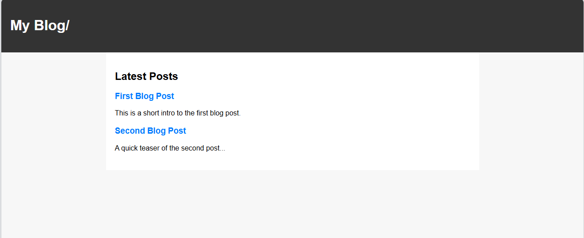
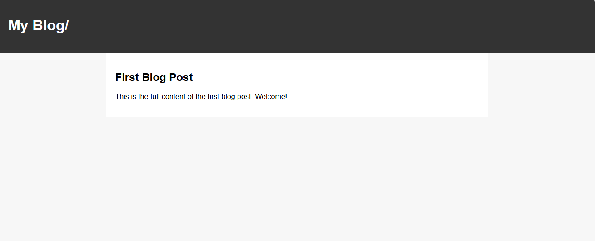

# React Blog App

A simple blog application built with **React** to demonstrate my skills in front-end development, routing, and component-based design.  
This project is part of my portfolio and will be expanded with more features like forms, Bootstrap styling, and database integration.

---

## Features
- Browse a list of blog posts
- View individual post details via dynamic routing
- Static data source for easy setup
- Responsive design ready for future styling

---

## Tech Stack
- **React** (Functional components + Hooks)
- **React Router** for navigation
- **JavaScript (ES6+)**
- **CSS** for basic styling

---

## Demo
🚀 Live version: [React Blog App](https://react-blog-1-ten.vercel.

---

## Screenshots




---
## Future Improvements

Add new post form
Integrate Bootstrap for styling
Connect to a backend (Node.js/Express) with database (PostgreSQL/MongoDB)
User authentication system

---

## Author

- Victor Njoroge Ngugi
- LinkedIn: https://www.linkedin.com/in/victor-njoroge-ngugi/
- Email: nvngugi@gmail.com

---

## Installation
Clone the repository and install dependencies:


```bash
git clone https://github.com/YOUR_USERNAME/react-blog.git
cd react-blog
npm install
npm start

